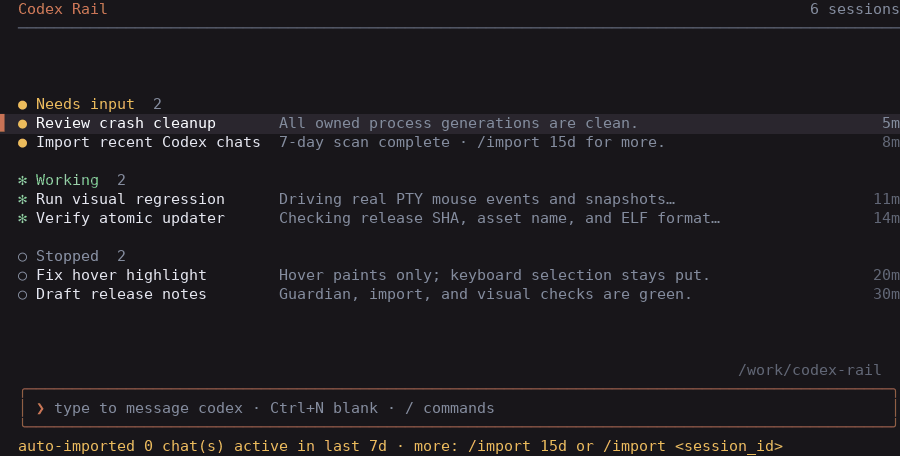

# Codex Rail

Codex Rail (`rail`) is a lightweight session manager for running many
[Codex CLI](https://github.com/openai/codex) sessions in parallel. It feels
close to Claude Code's agent view: one manager screen, background sessions
grouped by what they need from you, fast attach/detach, and no tmux or split
panes.



## What it does

- **Runs sessions in the background.** Each session has a guardian plus a worker
  holding a PTY that runs real `codex`. Closing the manager (or your terminal)
  leaves sessions running; if the worker crashes, the guardian reaps its whole
  owned process generation before Rail permits a resume.
- **Groups by status, like Claude Code's agents panel.** Sessions bucket into
  **Needs input** / **Working** / **Stopped**, with the ones wanting your
  attention floating to the top. Each row shows codex's latest message.
- **Start a session with a first message.** Type your first instruction and
  press Enter; `rail` waits for Codex's composer and submits it through the PTY,
  so private prompt text is never placed in a process argument. Use `Ctrl+N` for
  a blank, auto-numbered session.
- **Resume exited sessions.** `rail` records each session's codex id and can
  `codex resume` it, restoring the full conversation.
- **Live titles.** A session's title follows its first codex message
  automatically (read from codex's history), unless you pin a name with a
  rename.

## How it works

One **manager** process draws the UI; each session gets a **guardian** and a
**worker**. They stay decoupled through per-session files, a Unix socket for
live attach, and Codex's own transcript files (read-only). The worker owns
`state.json` runtime fields, while title changes are serialized through
`label.json`; per-session leases prevent duplicate workers, guardians, title
writes, removals, and autopilot drivers.

```
┌───────────────────────────────────────────────────────────────┐
│  rail  (manager — the UI you run with `rail`)                  │
│   reads every state.json ~700ms → classify / sort / draw       │
│   handles keys; on attach, bridges your terminal to a worker   │
└──────┬───────────────────────┬──────────────────────┬─────────┘
  read │ state.json      write │ label.json     attach │ Unix socket
       │ (status, ids)         │ (title + pin)         │ (live I/O)
       ▼                       ▼                       ▼
  jobs/<id>/state.json    jobs/<id>/label.json  (label wins over state's title)
       ▲                                               ▲
 write │ status / codex id / timestamps          PTY  │ input & output
┌──────┴────────────────────────────────────────┴───────────────┐
│  rail --guardian <id>  (owns and reaps one process generation) │
│        └─ rail --worker <id>  (PTY + socket + state owner)      │
│             captures and exclusively claims Codex's rollout    │
└──────────────────────────┬────────────────────────────────────┘
                     runs codex (real CLI, in the PTY)
                           │ writes
                           ▼
   ~/.codex/sessions/.../rollout-*.jsonl   (turn lifecycle → status + preview)
   ~/.codex/history.jsonl                  (first message → title sync)
```

Design points:

- **Crash-safe process ownership.** The manager can die without stopping
  sessions. On Linux, each guardian is a subreaper and each worker generation
  carries a unique token. Stop, resume, and removal fail closed until a process
  census proves that Codex and all of its MCP/helper descendants are gone.
- **The title can't be clobbered.** Rename and automatic title sync serialize
  updates to `label.json`; a pinned user title always wins over worker runtime
  state and stale automatic sync attempts.
- **Rollouts cannot cross-wire.** A worker identifies the rollout opened by its
  own Codex process, checks the exact session id, and claims that path with a
  no-replace file operation. Rail never guesses by working directory or launch
  time, so simultaneous sessions in the same directory cannot steal each
  other's resume id.
- **Status without guessing.** Activity is read from codex's rollout lifecycle
  (`task_started` … `task_complete`), tracked incrementally: each refresh scans
  only the bytes appended since the last one and latches the most recent marker.
  This matters because codex can work for over a minute writing nothing to the
  rollout, and a single turn can span far more than any fixed tail window — so a
  bounded tail-scan or an mtime/last-modified heuristic would read "idle" mid-turn.
  PTY output timing is deliberately *not* used either, because codex's animated
  TUI would keep every session looking busy.
- **Needs input vs Stopped.** *Needs input* means the process is alive but codex
  finished its turn and is waiting for you. *Stopped* means the process has
  exited — it needs a resume, not a reply. Liveness is checked from the worker's
  actual process state, and a **zombie** (a worker that exited but wasn't reaped,
  e.g. under a container init that doesn't reap orphans) counts as stopped, not
  alive — otherwise its session would be pinned to "running" forever and could
  never be stopped or removed.
- **Removing a session** (`Ctrl-X` on an already-stopped one) deletes only
  rail's own per-session dir; codex's transcript under `~/.codex/sessions` stays,
  so nothing you did in that session is lost from codex's own history.
- **Resume reuses the same rollout file**, so a resumed session's status stays
  accurate.
- **The panel rests where your eyes are.** When the sessions fit on screen the
  whole list floats to the vertical middle instead of pinning under the header —
  a programmer's gaze sits at the centre of the screen, not its top edge. It only
  falls back to a top-anchored scroll once there are more sessions than fit.

## Controls

Manager screen (the bottom line always shows the relevant keys):

- `↑` / `↓`: move selection
- `Enter` / `→` (or mouse click): attach the selected session
- mouse hover: softly highlight the row under the pointer without changing the
  keyboard selection; the wheel still moves the selection
- just start typing: compose a new session — printable keys such as `w`, `s`,
  `d`, `e`, and Space are text, never hidden manager shortcuts
- `Ctrl+N`: start a blank, auto-numbered session
- `Ctrl+R`: rename the selected session (pins the title against auto-sync)
- `Ctrl+X` twice within 2s: stop the selected session; press it twice again on an
  already-stopped session to **remove** it from the list (deletes its state, so
  the row finally goes away — the codex transcript on disk is left untouched)
- `Ctrl+D`: distill your response style **and problem-solving logic** from your
  past codex *and* Claude Code conversations (see below)
- `Esc` twice within 2s: leave the manager (sessions keep running)
- `Ctrl+A`: toggle **autopilot** on the selected session (see below)
- `/`: open Rail's command palette. A unique prefix runs the highlighted command,
  so `/di` then `Enter` runs `/distill`. Text that is not a Rail command (for
  example `/review`) remains an ordinary prompt and is sent to Codex on `Enter`.
- `/import 15d`: extend this manager's Codex-history scan to rollouts modified in
  the last 15 days. Replace `15` with the window you need.
- `/import <session_id>`: import one exact Codex session regardless of age. It
  must still belong to the manager's current working directory; using an exact id
  also restores a session you previously removed from Rail's imported rows.

Only sections that actually have sessions are shown (an empty *Working* or
*Needs input* block is hidden rather than drawn as "none"), and the list floats
to the vertical middle when it fits. The selected session's working directory
sits faint and right-aligned on the row just above the composer box. Transient
status and confirm prompts appear on the bottom line, never inside the composer
box.

Attached session:

- `Ctrl+Z`: detach back to the manager. codex draws over the whole screen with
  no room for a persistent status bar, so before each of your first several
  attaches rail shows a brief full-screen note — with a progress bar that fills
  as the handoff nears — reminding you of this key. The note also says how many
  more times it will appear, so you know it is temporary; after the last one it
  stops and attaches are instant. (The note is drawn in its own alternate screen
  buffer, so re-attaching never clears or clobbers codex's screen.)
- every other key passes through to codex

## Distill your style *and logic*

`Ctrl+D` in the manager kicks off **archive distillation**: rail reads back
through your past conversations — from **both** codex (`~/.codex/sessions`) and
Claude Code (`~/.claude/projects`) — and launches a codex session that profiles
not just *how you write* (voice, instructions, feedback, recurring phrases) but
*how you think*: how you diagnose problems, what makes you approve vs. push back,
how you drive a task from opening to done. The result is a versioned
`~/.config/codex-rail/distill/style-vNNN.md`.

The key is **context**: rather than dumping your messages in isolation, rail
keeps each of your turns next to a compressed lead-in of what the assistant had
just said or done, so the distiller can see *why* you steered the way you did.
The raw transcripts are huge (hundreds of MB of codex, GBs of Claude, mostly
re-injected context and tool output), so rail ranks your richest sessions and
packs them into a small, **fully readable** corpus of numbered chunks under a
unique `~/.config/codex-rail/distill/runs/run-*/corpus/`. The launched Codex session is told to
read every chunk end-to-end (not grep or sample) and echo back a marker from
each, giving Rail a machine-checkable completion signal that rejects stale or
partial outputs (without pretending model-side reading is cryptographically provable).

The scan runs on a background thread — the manager stays live and shows a
"Preparing … Ns" status while it works — then launches a session tagged
**`[distill vN]`**. It shows an elapsed-time / rough-ETA hint while running and
flips to **Done** only after Codex is waiting, the exact coverage contract has
validated, the output is durably marked, and the one-shot worker has exited.
Concurrent managers share one lifetime lock and reserve versions atomically, so
they cannot overwrite a corpus or style version. (Everything stays local under
`~/.config/codex-rail` and is never committed.)

Prompts are English-only for now.

## Autopilot

Press **`Ctrl+A`** on a session to hand it to **autopilot** — rail answers it for
you while you're away. Under the hood rail launches a **pilot**: a real, visible
codex session (it appears grouped right under its main as `↳ pilot · …`, and you
can attach to it to watch or step in at any time). Each time the main session
finishes a turn and waits for you, rail nudges the pilot, which reads your
distilled style (`style-vNNN.md`, from `Ctrl+D`) plus the session's latest
message and writes the reply *in your voice and judgment*; rail then types that
reply back into the main session — the same keystrokes you would.

It stays in your control:

- The main row shows a live badge — `⟳ auto N/cap` while active, or why it
  **handed back** to you when it pauses.
- The pilot hands back (and autopilot stops) when the task looks **done**, when
  something **risky/irreversible** is proposed, when it's **unsure**, or after a
  **reply cap** (default 8; `CODEX_RAIL_AUTOPILOT_CAP`) — so it never runs away.
- Attach to the main at any time; while you're attached Rail's explicit inject
  handshake returns busy and sends no bytes, so you can take over safely.
  `Ctrl+A` again turns autopilot off and cleans up the linked pilot.
- The pilot runs **read-only** and at a lighter reasoning effort for speed
  (`CODEX_RAIL_PILOT_EFFORT`, `CODEX_RAIL_PILOT_MODEL` to override); it inherits
  your codex model otherwise.

Autopilot is best for keeping a session moving through routine continuations, not
for high-stakes judgment calls — which is exactly what the hand-back rules protect.

## Install

Download the static Linux binary for your architecture from the [latest
release](https://github.com/saofund/codex-rail/releases/latest) —
`rail-x86_64-linux` or `rail-aarch64-linux` — then:

```sh
install -m755 rail-x86_64-linux ~/.local/bin/rail
```

Or build from source:

```sh
cargo build --release
install -m755 target/release/rail ~/.local/bin/rail
```

## Update

`rail --version` shows the build. On Linux, run **`rail update`** (or
**`/update`** in the manager) to fetch the matching release asset, verify its
format and exact build identity, and replace the executable atomically; the
manager also shows a quiet **"↑ update available"** in the header. Set
`CODEX_RAIL_CODEX=/path/to/codex` if `codex` is not on `PATH`.

## Data layout

- State: `$XDG_DATA_HOME/codex-rail/jobs` (or `~/.local/share/codex-rail/jobs`)
  - `state.json` — worker-owned runtime (status, codex id, rollout path, pids)
  - `label.json` — manager-owned title + pin flag (authoritative over the title)
  - `output.log` — per-session terminal output
  - `.locks/<id>.init.lock` — serializes manager resume/remove for one session
  - `.locks/<id>.worker.lock` — held for the lifetime of the session worker
  - `.locks/<id>.generation.lock` — held while a guardian owns/cleans a generation
  - `.locks/<id>.autopilot.lock` — lets one manager drive a main session's pilot
  - `.stop-<generation>.request` — socket-independent, generation-scoped stop fallback
- Sockets: `$XDG_RUNTIME_DIR/codex-rail` (or `/tmp/codex-rail-$UID`)
- Distillation: `$XDG_CONFIG_HOME/codex-rail/distill` (or `~/.config/codex-rail/distill`)
  - `style-vNNN.md` + `.validated` — validated, versioned style summaries
  - `runs/run-*/corpus/` — run-isolated message chunks
  - `claims/style-vNNN.claim` — atomic, no-reuse version reservations

State, socket, and distillation data are locked to the owner (`0600` files,
`0700` directories). On startup rail also tightens permissions left by older
versions without following symlinks outside its data directories.

## Limits

- Linux only. Rail intentionally refuses to start sessions on other Unix
  targets: its no-orphan guarantee requires Linux subreapers and `/proc` process
  identity/census support. In particular, macOS is not published as a supported
  asset until an equivalent crash-cleanup proof exists.
- Rail automatically imports only Codex rollouts from the current working
  directory that were modified in the last **7 days** and contain a genuine user
  turn. Older, empty, synthetic-marker-only, and other-directory transcripts do
  not clutter the initial list. The startup hint advertises `/import 15d` and
  `/import <session_id>` when you need to widen that scope; an exact id bypasses
  age, never the current-directory boundary. Live process control is limited to
  sessions launched or resumed through Rail.
- One active attachment per session; a second attach is refused until the first
  detaches.
- Status and title sync rely on Codex's on-disk transcript format, which is
  undocumented and may change between Codex versions; the fixture and live
  compatibility gates must be refreshed when that format changes.
