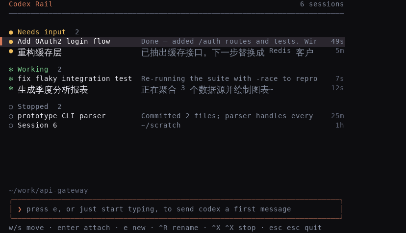

# Codex Rail

Codex Rail (`rail`) is a lightweight session manager for running many
[Codex CLI](https://github.com/openai/codex) sessions in parallel. It feels
close to Claude Code's agent view: one manager screen, background sessions
grouped by what they need from you, fast attach/detach, and no tmux or split
panes.



## What it does

- **Runs sessions in the background.** Each session is its own worker process
  holding a PTY that runs real `codex`. Closing the manager (or your terminal)
  leaves sessions running.
- **Groups by status, like Claude Code's agents panel.** Sessions bucket into
  **Needs input** / **Working** / **Stopped**, with the ones wanting your
  attention floating to the top. Each row shows codex's latest message.
- **Start a session with a first message.** Type your first instruction and
  press Enter; `rail` launches `codex` with it so the turn starts immediately.
  Leave it empty for a blank, auto-numbered session.
- **Resume exited sessions.** `rail` records each session's codex id and can
  `codex resume` it, restoring the full conversation.
- **Live titles.** A session's title follows its first codex message
  automatically (read from codex's history), unless you pin a name with a
  rename.

## How it works

One **manager** process draws the UI; each session gets its own **worker**
process. They stay decoupled through per-session files, a Unix socket for live
attach, and codex's own transcript files (read-only). Crucially the two
processes write **disjoint** files: the worker owns `state.json` (runtime), the
manager owns `label.json` (the title). Nothing they each write can clobber the
other.

```
┌───────────────────────────────────────────────────────────────┐
│  rail  (manager — the UI you run with `rail`)                  │
│   reads every state.json ~700ms → classify / sort / draw       │
│   handles keys; on attach, bridges your terminal to a worker   │
└──────┬───────────────────────┬──────────────────────┬─────────┘
  read │ state.json      write │ label.json     attach │ Unix socket
       │ (status, ids)         │ (title + pin)         │ (live I/O)
       ▼                       ▼                       ▼
  jobs/<id>/state.json    jobs/<id>/label.json  (label wins over state's title)
       ▲                                               ▲
 write │ status / codex id / timestamps          PTY  │ input & output
┌──────┴────────────────────────────────────────┴───────────────┐
│  rail --worker <id>  (one per session; outlives the manager)   │
│   owns a PTY running real codex; binds the Unix socket         │
│   captures codex's rollout path + session id; reaps its child  │
└──────────────────────────┬────────────────────────────────────┘
                     runs codex (real CLI, in the PTY)
                           │ writes
                           ▼
   ~/.codex/sessions/.../rollout-*.jsonl   (turn lifecycle → status + preview)
   ~/.codex/history.jsonl                  (first message → title sync)
```

Design points:

- **Process isolation.** The manager only reads/writes state files and draws;
  the worker owns the codex process. If the manager dies, sessions keep
  running; if a worker dies, the manager marks it Stopped on its next refresh.
- **The title can't be clobbered.** A rename (and automatic title sync) writes
  only `label.json`, which the manager owns; the worker only ever writes
  `state.json`. Since the label always wins on load, a rename sticks instantly
  even while an old — or duplicate — worker keeps rewriting `state.json`.
- **Preview/status self-heal.** If a worker never recorded a rollout path (a
  session started blank, a slow cold start, an older build), the manager
  recovers it by matching codex's own `session_meta` cwd and start time, so the
  row still shows a live status and codex's latest message instead of a bare path.
- **Status without guessing.** Activity is read from codex's rollout lifecycle
  (`task_started` … `task_complete`), tracked incrementally: each refresh scans
  only the bytes appended since the last one and latches the most recent marker.
  This matters because codex can work for over a minute writing nothing to the
  rollout, and a single turn can span far more than any fixed tail window — so a
  bounded tail-scan or an mtime/last-modified heuristic would read "idle" mid-turn.
  PTY output timing is deliberately *not* used either, because codex's animated
  TUI would keep every session looking busy.
- **Needs input vs Stopped.** *Needs input* means the process is alive but codex
  finished its turn and is waiting for you. *Stopped* means the process has
  exited — it needs a resume, not a reply. Liveness is checked from the worker's
  actual process state, and a **zombie** (a worker that exited but wasn't reaped,
  e.g. under a container init that doesn't reap orphans) counts as stopped, not
  alive — otherwise its session would be pinned to "running" forever and could
  never be stopped or removed.
- **Removing a session** (`Ctrl-X` on an already-stopped one) deletes only
  rail's own per-session dir; codex's transcript under `~/.codex/sessions` stays,
  so nothing you did in that session is lost from codex's own history.
- **Resume reuses the same rollout file**, so a resumed session's status stays
  accurate.
- **The panel rests where your eyes are.** When the sessions fit on screen the
  whole list floats to the vertical middle instead of pinning under the header —
  a programmer's gaze sits at the centre of the screen, not its top edge. It only
  falls back to a top-anchored scroll once there are more sessions than fit.

## Controls

Manager screen (the bottom line always shows the relevant keys):

- `↑` / `↓` (or `w` / `s`): move selection
- `Enter` (or `→` / `d`, or mouse click): attach the selected session
- `e`, or just start typing: compose a new session — your text becomes codex's
  first message (empty → a blank, auto-numbered session)
- `Ctrl+R`: rename the selected session (pins the title against auto-sync)
- `Ctrl+X` twice within 2s: stop the selected session; press it twice again on an
  already-stopped session to **remove** it from the list (deletes its state, so
  the row finally goes away — the codex transcript on disk is left untouched)
- `Esc` twice within 2s: leave the manager (sessions keep running)
- `Space` is reserved for a future feature and does nothing here

Only sections that actually have sessions are shown (an empty *Working* or
*Needs input* block is hidden rather than drawn as "none"), and the list floats
to the vertical middle when it fits. Transient status and confirm prompts appear
on the bottom line, never inside the composer box.

Attached session:

- `Ctrl+Z`: detach back to the manager. codex draws over the whole screen with
  no room for a persistent status bar, so before each of your first several
  attaches rail shows a brief full-screen countdown reminding you of this key;
  after that it stops and attaches are instant.
- every other key passes through to codex

## Install

```sh
cargo build --release
install -m755 target/release/rail ~/.local/bin/rail
```

Set `CODEX_RAIL_CODEX=/path/to/codex` if `codex` is not on `PATH`.

## Data layout

- State: `$XDG_DATA_HOME/codex-rail/jobs` (or `~/.local/share/codex-rail/jobs`)
  - `state.json` — worker-owned runtime (status, codex id, rollout path, pids)
  - `label.json` — manager-owned title + pin flag (authoritative over the title)
  - `output.log` — per-session terminal output
- Sockets: `$XDG_RUNTIME_DIR/codex-rail` (or `/tmp/codex-rail-$UID`)

State and socket files are locked to the owner (`0600`/`0700`).

## Limits

- Unix-like systems only.
- Only sessions launched by `rail` are managed.
- One active attachment per session; a second attach is refused until the first
  detaches.
- Status and title sync rely on codex's on-disk transcript format, which is
  undocumented and may change between codex versions (verified against
  codex-cli 0.142.5).
